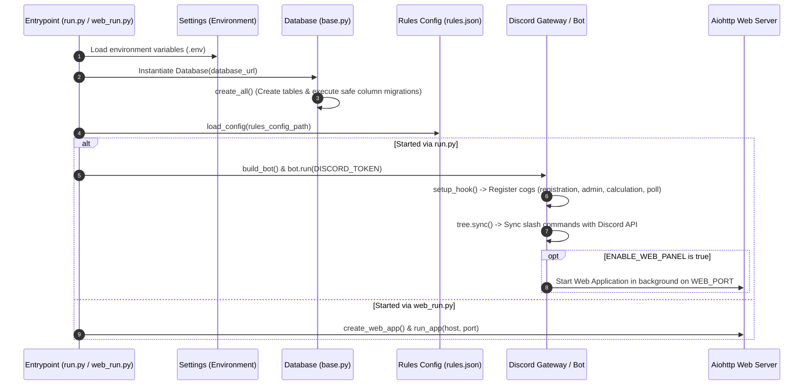
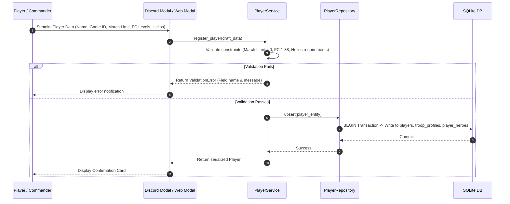
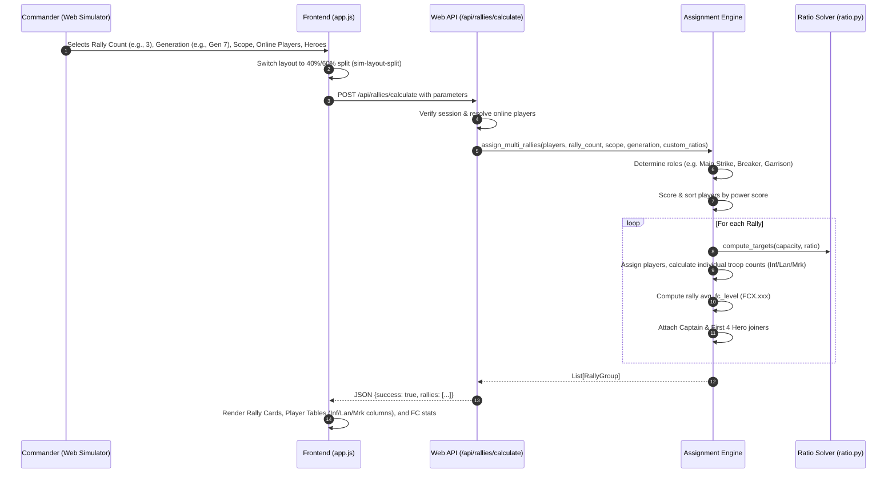
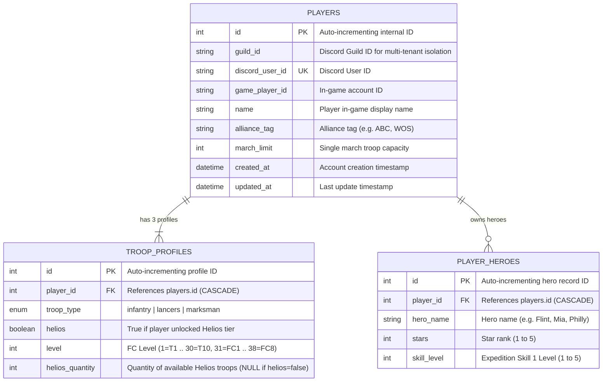

# Discord Troop Bot & Web Command Center — Architecture & Technical Reference

> Complete documentation detailing the project architecture, directory structure, module roles, lifecycle flows, database schema, algorithms, and deployment guide.

---

## 1. Executive Summary & Core Objectives 

**Discord Troop Bot** (Troop Command Center) is an end-to-end tactical troop management, optimization, and multi-rally coordination platform designed for competitive alliance strategy games (specifically Whiteout Survival).

It serves two primary interfaces:
1. **Discord Bot (Slash Commands & Modals):** Allows players to register their troop tier (Fire Crystal levels, Helios capabilities, march limits, and hero stats) via interactive modals directly in Discord, participate in event attendance polls, and calculate troop compositions.
2. **Web Command Center (Single Page Application & REST API):** A rich, dark-mode real-time tactical dashboard for Alliance Leaders / R5 / R4 commanders to:
   - View roster statistics, filter by Generation (Gen 1 to Gen 10) and Alliance Tags.
   - Run real-time single-rally and multi-rally (1 to 6 concurrent marches) calculations.
   - Assign online members dynamically into specific roles (Main Strike, Breaker, Garrison) adhering to strict march limits and ratio constraints.
   - Manage hero compositions (Captain + 3 heroes, plus first 4 joiners) and event attendance polls.
   - Import/export player rosters via CSV and configure scoring weights.

---

## 2. Directory & File Structure Breakdown

```
discord-troop-bot/
├── .env / .env.example          # Environment variables (Tokens, Database URL, Keys, Ports)
├── Dockerfile                   # Production container definition (Python 3.11-slim)
├── docker-compose.yml           # Production container orchestration
├── requirements.txt             # Python runtime dependencies
├── run.py                       # Main Discord Bot process entrypoint
├── web_run.py                   # Standalone Web Admin Panel entrypoint
├── setup_oracle.sh              # Ubuntu/Oracle Cloud deployment automation script
├── troop_bot.db                 # SQLite database file (production/local)
│
├── config/                      # Configuration & scoring rules
│   ├── rules.json               # Active scoring weights (Attack/Defence, FC, Helios, Modifiers)
│   └── rules.json.example       # Default reference config template
│
├── bot/                         # Core Python Application Package
│   ├── settings.py              # Pydantic Settings / Environment configuration loader
│   ├── discord_bot.py           # Custom commands.Bot class (Wires DB, Cogs & Background Web API)
│   │
│   ├── database/                # Persistence & Data Access Layer (SQLAlchemy 2.0)
│   │   ├── base.py              # Engine setup, sessionmaker, Base model, column migrations
│   │   ├── models/              # Declarative ORM entities
│   │   │   ├── __init__.py
│   │   │   └── player.py        # Player, TroopProfile, PlayerHero models & TroopType enum
│   │   └── repositories/        # Repository abstraction
│   │       ├── __init__.py
│   │       └── player_repository.py # CRUD operations for Players, Profiles, Heroes, Guild filtering
│   │
│   ├── discord/                 # Discord.py Interaction Layer (Cogs, Slash Commands, Modals)
│   │   ├── permissions.py       # Role & Admin permission decorators
│   │   ├── commands/            # Slash Command definitions (Cogs)
│   │   │   ├── registration.py  # /register, /profile, /update
│   │   │   ├── calculation.py   # /calculate, /optimize
│   │   │   ├── poll.py          # /attendance, /poll, /checkin
│   │   │   └── admin.py         # /admin roster overview, CSV import, clear data
│   │   ├── interactions/        # Wizard modals & multistep button flows
│   │   │   ├── registration_flow.py # Interactive multi-step player registration
│   │   │   ├── update_flow.py       # Profile updates
│   │   │   └── calculation_flow.py  # Discord-side formation calculations
│   │   └── views/               # Reusable Discord UI components (Buttons, Select Menus)
│   │       └── components.py
│   │
│   ├── optimizer/               # Mathematical Formation Solver
│   │   ├── types.py             # Domain dataclasses (OptimizerPlayer, Allocation, FormationResult)
│   │   ├── ratio.py             # Ratio parsing, capacity scaling, Largest-Remainder distribution
│   │   ├── ranking.py           # Scoring heuristics (FC tier weights, Helios bonus, mode multipliers)
│   │   ├── attack.py            # Attack-specific scoring curves
│   │   ├── defence.py           # Defense-specific scoring curves (Garrison buffer logic)
│   │   └── optimizer.py         # Main greedy deterministic solver for single formations
│   │
│   ├── recommendations/         # Multi-Rally Coordination & Hero Presets
│   │   ├── schemas.py           # Schemas (RallyGroup, PlayerAssignmentRow, RallyRole, EventScope)
│   │   ├── hero_data.py         # Hero database (Gen 1-10, skills, buffs, best joiner slots)
│   │   └── assignment_engine.py # Multi-Rally greedy balancer (1 to 6 rallies, power-score sorting)
│   │
│   ├── rules/                   # Business Rules & Formation Presets
│   │   ├── configuration.py     # RankingConfig loader and validator
│   │   └── formation_guide.py   # Generation troop presets (Inf/Lancer/Marksman ratios)
│   │
│   ├── services/                # Business Logic Layer (Intermediary between UI and Database)
│   │   ├── player_service.py    # Player validation, registration drafts, upserts
│   │   ├── formation_service.py # Bridges PlayerRepository with the Optimizer
│   │   └── csv_importer.py      # Robust CSV parsing (handles aliases, casing, missing columns)
│   │
│   └── web/                     # Web Dashboard & REST API
│       ├── app.py               # Aiohttp Application factory, routes registration, static file serving
│       ├── api.py               # REST API endpoints (Auth, Players, Calculation, Presets, Stats)
│       └── static/              # Frontend Single-Page Application assets
│           ├── index.html       # Single-page UI structure (Overview, Simulator, Roster, Rules, Guides)
│           ├── css/
│           │   └── style.css    # Premium glassmorphism design, responsive grid, animations
│           ├── js/
│           │   └── app.js       # Client-side state manager, API caller, interactive calculator
│           └── assets/
│               └── logo.svg     # UI brand mark
│
├── tests/                       # Pytest Test Suite
│   ├── conftest.py              # Test fixtures (in-memory SQLite, sample players)
│   ├── test_player_service.py   # Registration and player profile validation tests
│   ├── test_optimizer.py        # Mathematical constraint and ratio solver tests
│   ├── test_ratio.py            # Largest-remainder rounding and edge-case unit tests
│   ├── test_ranking.py          # Weight scoring tests
│   ├── test_hero_presets.py     # Generation hero presets validation
│   ├── test_csv_importer.py     # CSV parsing error handling and alias resolution tests
│   ├── test_web_api.py          # REST API endpoints & auth verification tests
│   └── test_edge_cases.py       # Boundary conditions (zero troops, excessive capacity, etc.)
│
└── documentation files/
    ├── README.md                # General introduction & quickstart
    ├── ORACLE_CLOUD_DEPLOY.md   # Production deployment walkthrough on Oracle VPS
    ├── SYSTEM_MECHANISMS.md     # Game mechanics, hero expedition skills, Helios mechanics
    ├── heros-data.md            # Hero reference matrix per generation
    └── implementation.md        # Technical specification and historical architecture notes
```

---

## 3. Detailed Role of Every Directory & Component

### 3.1. Project Root
* **`run.py`**: Boots the standalone Discord bot process (`python run.py`). Initializes database tables via SQLAlchemy metadata, connects to Discord Gateway, registers slash commands (`/register`, `/attendance`, `/calculate`), and optionally runs the web API concurrently if `ENABLE_WEB_PANEL=true`.
* **`web_run.py`**: Boots the standalone Web Command Center (`python web_run.py`). Serves the web UI and JSON REST endpoints on port 8080 (or `WEB_PORT`), independent of the Discord gateway connection.
* **`Dockerfile` & `docker-compose.yml`**: Packages the application into a containerized service with SQLite volume persistence, automatic container restarts, and exposed port 8080.
* **`setup_oracle.sh`**: Automated provisioning bash script for Ubuntu/Oracle Cloud Compute. Configures Docker, sets firewall iptables, binds ports, and launches the container.

### 3.2. `bot/database/` (Persistence Layer)
* **`base.py`**:
  * Configures the SQLAlchemy 2.0 Engine with `check_same_thread=False` for concurrent SQLite access across asyncio loops.
  * Contains `Database.create_all()` which runs table creation and automatic dynamic column migrations (e.g., adding `guild_id` or `alliance_tag` if upgrading from older schemas).
  * Implements `session()` context manager ensuring clean transactional commits and rollbacks on error.
* **`models/player.py`**:
  * `Player`: Stores player identity (Primary ID, `guild_id`, `discord_user_id`, `game_player_id`, `name`, `alliance_tag`, `march_limit`).
  * `TroopProfile`: Stores tier per troop type (`INFANTRY`, `LANCERS`, `MARKSMAN`), Fire Crystal level (`level` 1–38, representing T1 to FC8), Helios status (`helios`: bool), and `helios_quantity`.
  * `PlayerHero`: Stores owned heroes per player, star rank (1–5★), and expedition skill 1 level (1–5) for joiner priority sorting.
* **`repositories/player_repository.py`**:
  * Provides atomic query methods: `get_by_id`, `get_by_discord_id`, `list_all`, `upsert`, `delete`, and `clear_all`.
  * Enforces multi-tenant data isolation by filtering queries with `guild_id` when scoped to a specific Discord server.

### 3.3. `bot/services/` (Application Business Logic)
* **`player_service.py`**: Validates input data from Discord modals or Web forms. Enforces rules: name requirements, positive march limits, FC level limits (1-38), and validates that if Helios is enabled, a finite positive quantity is provided.
* **`formation_service.py`**: Extracts active players from `PlayerRepository`, converts database entities into `OptimizerPlayer` domain structures, and invokes the calculation engines.
* **`csv_importer.py`**: Ingests player roster spreadsheets. Tolerates messy real-world data (case-insensitive headers, space trimming, automatic resolution of column aliases such as "Troop Capacity" -> "March Limit").

### 3.4. `bot/optimizer/` (Deterministic Single-Formation Engine)
* **`ratio.py`**: Converts percentage ratios (e.g. 50/20/30) and desired capacity into integer targets using the **Largest Remainder Method (Hare-Niemeyer)** so that exact troop totals equal target capacity without rounding loss.
* **`ranking.py`**: Calculates an objective strength score for a candidate troop tier based on `rules.json` weights (Troop type factor × Level factor + Helios bonus).
* **`attack.py` & `defence.py`**: Specialized rule weights for attack vs. defensive scenarios. In defense (`garrison`), applies a 1.67x capacity buffer to mitigate reinforcement delays.
* **`optimizer.py`**: The greedy allocation solver:
  1. Generates candidate buckets `(player, troop_type, score)`.
  2. Sorts candidates by descending score.
  3. Fills targets greedily while strictly respecting each player's shared `march_limit` and finite Helios stock.
  4. Returns `FormationResult` with assigned marches and shortfall diagnostics.

### 3.5. `bot/recommendations/` (Multi-Rally & Hero Assignment Engine)
* **`assignment_engine.py`**:
  * Coordinates multi-rally attacks (1 to 6 concurrent rallies).
  * Automatically assigns rally roles according to rally count (e.g., Rally 1 = Main Strike, Rally 2 = Breaker, Rally 3 = Garrison).
  * Sorts online players by a combined power score (`FC level × 10 + 50 × Helios count + march_limit / 10000`).
  * Allocates players into rallies so that higher-scoring players lead or fill primary strike teams, and balances player capacity across marches.
  * Calculates the exact average FC level (`FCX.xxx`) for each individual rally.
* **`hero_data.py`**: Maintains generation presets (Gen 1 through Gen 10), hero skills, expedition bonus mechanics, and recommendations for the First 4 Joiners.
* **`schemas.py`**: Data structures defining `RallyGroup`, `PlayerAssignmentRow`, `RallyRole`, and `EventScope`.

### 3.6. `bot/rules/`
* **`configuration.py`**: Loads `config/rules.json`. Provides fallback default weights if the file is missing or invalid.
* **`formation_guide.py`**: Preconfigured community tactical ratios for diverse events (Sunfire Castle, Facility Battles, SvS, Fortresses).

### 3.7. `bot/web/` (Web Panel & REST API)
* **`app.py`**: Factory initializing the Aiohttp web server, registering routes, serving static files (`/static`), and setting up CORS and request context.
* **`api.py`**: Handles incoming HTTP requests:
  * Authentication: Passkey verification (`ADMIN_PANEL_KEY`) and Discord OAuth2 login with session cookie signing via HMAC-SHA256.
  * CRUD: `/api/players` (List, Create, Update, Delete, Clear, CSV Import).
  * Optimization: `/api/calculate` (Single formation) and `/api/rallies/calculate` (Multi-rally solver).
  * Rules & Guides: `/api/rules` and `/api/presets`.
  * Attendance: `/api/attendance/check-in`, `/api/attendance/select-all`, `/api/attendance/reset`.
* **`static/` (Frontend)**:
  * **`index.html`**: Tabbed interface featuring Overview, Formation Optimizer Simulator, Player Roster, Scoring Rules, and Guides.
  * **`css/style.css`**: Modern UI with CSS Grid, flex layouts, custom scrollbars, animations, and the dynamic `sim-layout-split` (40% parameters / 60% results) on calculation.
  * **`js/app.js`**: Frontend controller managing reactive state, attendance checkmarks, hero selectors, ratio sliders, API network calls, and DOM rendering.

---

## 4. Lifecycle & Data Flows (Cycle de Vie)

### 4.1. Application Boot Lifecycle



---

### 4.2. Player Registration Flow (Discord & Web)



---

### 4.3. Tactical Multi-Rally Calculation Flow



---

## 5. Database Schema Architecture

The database uses SQLite managed via SQLAlchemy 2.0 ORM. Cascade deletions ensure data integrity: removing a `Player` automatically purges related `TroopProfile` and `PlayerHero` records.



### Constraints & Indexes
1. `players.discord_user_id`: Unique index ensuring one profile per Discord account.
2. `players.guild_id` & `players.alliance_tag`: Indexed for quick server-side multi-tenant filtering.
3. `uq_player_troop_type`: Unique composite constraint on `(player_id, troop_type)` ensuring each player has exactly one profile per troop category.
4. `uq_player_hero`: Unique composite constraint on `(player_id, hero_name)` preventing duplicate hero entries.

---

## 6. Mathematical Formulations & Algorithms

### 6.1. Troop Target Distribution (Largest Remainder Method)
Given a desired capacity $C$ and percentage ratios $R_{\text{inf}}, R_{\text{lan}}, R_{\text{mrk}}$ where $\sum R_i = 100$:

1. Exact real allocations are computed:
   $$A_i = \frac{C \times R_i}{100}$$
2. Integer base allocation:
   $$I_i = \lfloor A_i \rfloor$$
3. Remainder calculation:
   $$f_i = A_i - I_i$$
4. Shortfall units:
   $$K = C - \sum I_i$$
5. The $K$ units are distributed one by one to troop types with the highest remainders $f_i$. This guarantees:
   $$\sum \text{final\_targets} = C \quad \text{with zero rounding drift.}$$

### 6.2. Candidate Scoring Formula
A player's contribution for a specific troop type is evaluated using weights from `config/rules.json`:

$$\text{Score} = (W_{\text{type}} \times M_{\text{mode}}) \times (L \times W_{\text{fc}}) + (H \times W_{\text{helios}})$$

Where:
* $W_{\text{type}}$: Troop weight (e.g., Infantry = 3.0 in Attack, 3.5 in Defense).
* $M_{\text{mode}}$: Global mode multiplier (`rally_modifier` or `garrison_modifier`).
* $L$: Numeric Fire Crystal level (e.g., T10 = 30, FC5 = 35, FC8 = 38).
* $W_{\text{fc}}$: Fire Crystal tier weight.
* $H$: Boolean (1 if Helios enabled, 0 otherwise).
* $W_{\text{helios}}$: Bonus weight granted to Helios units.

### 6.3. Average FC Formatting
Average Fire Crystal levels represent the true troop tier across the alliance or within an individual rally.
If numeric level $L \ge 31$, it maps to Fire Crystal tier:

$$\text{FC Tier} = L - 30$$

The system formats averages to exactly three decimal places (e.g., `FC5.625` or `T10.500`), providing commanders with granular visibility into team strength.

---

## 7. Configuration Reference (`config/rules.json`)

| Key | Default | Description |
|---|---|---|
| `attack.infantry_weight` | `3.0` | Importance of Infantry in offensive rallies (absorbing hits). |
| `attack.lancer_weight` | `1.5` | Importance of Lancers in offensive attacks (flanking). |
| `attack.marksman_weight` | `3.0` | Importance of Marksmen in attacks (backline DPS). |
| `attack.helios_weight` | `2.0` | Priority boost for Helios units in offensive formations. |
| `attack.fc_weight` | `1.0` | Multiplier applied to player FC level. |
| `defence.infantry_weight` | `3.5` | Defense priority: high Infantry weight to protect garrisons. |
| `defence.lancer_weight` | `1.5` | Defensive Lancer counter-attack factor. |
| `defence.marksman_weight`| `0.5` | Reduced marksman weight for defensive endurance. |
| `defence.helios_weight` | `2.0` | Priority boost for Helios units in garrison defense. |
| `defence.fc_weight` | `1.0` | Multiplier applied to player FC level in defense. |
| `rally_modifier` | `1.0` | Global scaling factor for offensive calculations. |
| `garrison_modifier` | `1.0` | Global scaling factor for defensive calculations. |

---

## 8. Deployment & Environment Reference

### Environment Variables (`.env`)

| Variable | Type | Description | Example |
|---|---|---|---|
| `DISCORD_TOKEN` | String | Bot token from Discord Developer Portal | `MTA...` |
| `DISCORD_CLIENT_ID` | String | Application Client ID (for OAuth2) | `123456789...` |
| `DISCORD_CLIENT_SECRET` | String | Application Secret (for OAuth2) | `abcdef123...` |
| `DISCORD_REDIRECT_URI` | String | OAuth2 callback URL | `http://your-server-ip:8080/api/auth/discord/callback` |
| `DATABASE_URL` | String | SQLite or PostgreSQL connection string | `sqlite:///troop_bot.db` |
| `RULES_CONFIG_PATH` | Path | Relative or absolute path to scoring config | `config/rules.json` |
| `ADMIN_PANEL_KEY` | String | Master passkey for web panel access | `secret_admin_passkey_123` |
| `WEB_HOST` | String | Interface to bind web server | `0.0.0.0` |
| `WEB_PORT` | Integer | HTTP port for web dashboard | `8080` |
| `ENABLE_WEB_PANEL` | Boolean | Launch web panel concurrently inside bot process | `true` |

### Quick Start Commands

```bash
# 1. Run local tests
pytest

# 2. Run the Discord Bot
python run.py

# 3. Run the Web Dashboard independently
python web_run.py

# 4. Production Run via Docker Compose
docker compose up -d --build
```
